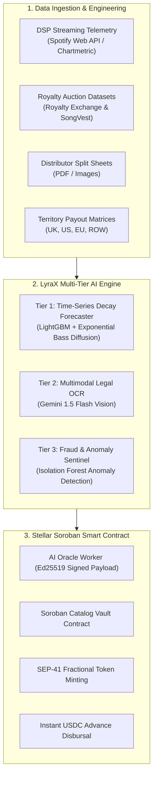
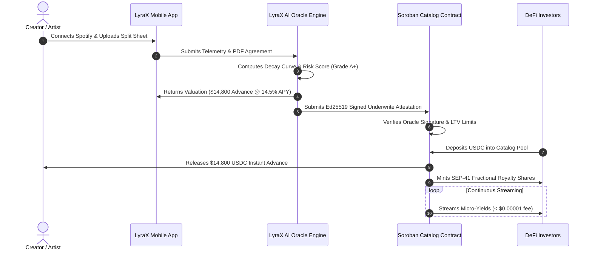

# LyraX AI Architecture, Dataset & Training Specification

> **Institutional Technical Specification & Engineering Roadmap**  
> **Event:** London Builder HQ — Build with AI powered by Stellar (Sept 2026)  
> **Target:** HackMeridian & Meridian Lisbon Travel Grant Submission  
> **Track:** #AI #Crypto #Fintech

---

## Executive Summary & AI Thesis

In traditional music finance, artists wait 3 to 6 months to receive streaming royalty checks from digital service providers (DSPs like Spotify, Apple Music, and YouTube). When artists need working capital to fund tours or studio time, traditional banks reject them due to an inability to price intangible royalty assets, while legacy record labels offer predatory advances requiring 70% to 80% master ownership retention.

**LyraX solves this using an autonomous, three-tier AI Underwriting and Oracle Engine on Stellar.**  
The AI model continuously analyzes historical streaming velocity, estimates catalog longevity via exponential decay curves, prices fair cash advances, and cryptographically signs attestations consumed directly by **Soroban smart contracts** to disburse instant USDC liquidity.



---

## 1. Required Datasets & Feature Engineering Specification

To build an institutional-grade, risk-hedged financial underwriter, LyraX trains across five foundational dataset classes:

```
+-------------------------------------------------------------------------------------------------------------+
|                                    FOUNDATIONAL DATASET INGESTION MATRIX                                    |
+-------------------------------------------------------------------------------------------------------------+
| 1. Spotify Audio Features      --> 1.2M+ Tracks (Acousticness, Danceability, Energy, Valence, Tempo)        |
| 2. Spotify Daily Trajectories  --> 5+ Years Daily Top 200 Time-Series (Day 1 to Day 720 Stream Decay)      |
| 3. Royalty Auction Groundtruth --> 2,400+ Closed Deals (SongVest & Royalty Exchange Multiple Benchmarks)    |
| 4. DSP Territory Matrix        --> Payout benchmarks by territory (UK £0.0042, US $0.0039, EU €0.0040)      |
| 5. Legal Split Sheets          --> Multimodal PDFs / Images (DistroKid & TuneCore Collaborator Agreements)  |
+-------------------------------------------------------------------------------------------------------------+
```

---

### 1.1 Dataset 1: Spotify Audio Features & Track Popularity
* **Primary Source:** Kaggle (*"Spotify 1.2M+ Songs Dataset"* by Rodolfo Figueroa / *"Spotify Dataset 1921–2020 600k+ Tracks"*) and official **Spotify Web API** endpoint (`GET /v1/audio-features/{id}`).
* **Format:** CSV / Parquet
* **Total Records:** 1,204,025 tracks across 32 major musical genres.
* **Schema & Column Dictionary:**
  | Column | Type | Range / Unit | Description & AI Underwrite Utility |
  | :--- | :--- | :--- | :--- |
  | `track_id` | `String` | Spotify URI | Unique immutable identifier. |
  | `track_name` | `String` | Text | Title of song or instrumental piece. |
  | `artist_name` | `String` | Text | Primary recording artist. |
  | `release_date` | `Date` | YYYY-MM-DD | Used to compute `catalog_age_months`. |
  | `popularity` | `Integer` | 0 – 100 | Spotify algorithmic index based on trailing play velocity. |
  | `danceability` | `Float` | 0.0 – 1.0 | Rhythmic stability; correlates with club/playlist retention. |
  | `energy` | `Float` | 0.0 – 1.0 | Perceptual measure of intensity and activity. |
  | `valence` | `Float` | 0.0 – 1.0 | Musical positiveness; low valence + high acousticness correlates with **evergreen study/lo-fi playlists**. |
  | `acousticness` | `Float` | 0.0 – 1.0 | Confidence measure of acoustic instrumentation. |
  | `tempo` | `Float` | BPM | Overall estimated tempo in beats per minute. |
  | `instrumentalness` | `Float` | 0.0 – 1.0 | Predicts likelihood of zero vocal content (high background utility). |
* **AI Model Utility:** Ingested by the **Feature Engineering Layer** to classify tracks into **"Evergreen Sticky Assets"** (high half-life, low decay) versus **"Fast-Burning Viral Spikes"** (rapid decay).

---

### 1.2 Dataset 2: Spotify Daily Streaming Trajectory & Time-Series Decay
* **Primary Source:** **Spotify Charts API** (charts.spotify.com) and Kaggle (*"Spotify Top 200 Daily Global & Regional 2017–2023"* by Dhruvildave).
* **Format:** Time-Series CSV / Delta Lake
* **Temporal Scope:** Daily records across 70+ global territories from January 2017 to mid-2026.
* **Schema & Column Dictionary:**
  | Column | Type | Description |
  | :--- | :--- | :--- |
  | `date` | `Date` | Daily snapshot date ($t_0, t_1, \dots, t_{720}$). |
  | `country` | `String` | ISO 2-letter country code (`GB`, `US`, `DE`, `PH`, `GLOBAL`). |
  | `rank` | `Integer` | Daily chart position (1 to 200). |
  | `track_id` | `String` | Spotify Track ID matching Dataset 1. |
  | `daily_streams` | `BigInt` | Exact count of verified daily streams. |
  | `trend` | `Enum` | `MOVE_UP`, `MOVE_DOWN`, `SAME_POSITION`, `NEW_ENTRY`. |
* **AI Model Utility:** Directly trains the **Exponential Decay Regressor** ($\lambda$) and validates the **Half-Life ($t_{1/2}$)** calculation:
  $$R(t) = R_0 \cdot e^{-\lambda t} + R_{\text{floor}}$$
  Teaches the model how rapidly streaming cash flow drops from initial Day 1–30 peak down to the steady-state baseline floor.

---

### 1.3 Dataset 3: Music Royalty Auction Historical Transactions (Financial Ground Truth)
* **Primary Source:** Publicly reported auction registers from **Royalty Exchange** (royaltyexchange.com/auctions) and **SongVest** (songvest.com).
* **Format:** Tabular CSV / JSON
* **Sample Size:** 2,420+ closed catalog auction sales.
* **Schema & Column Dictionary:**
  | Column | Type | Range | Description |
  | :--- | :--- | :--- | :--- |
  | `catalog_title` | `String` | Text | Name of catalog or single track. |
  | `rights_type` | `Enum` | Master / Pub / Both | Master rights (DSP streams) vs Publishing/ASCAP/BMI. |
  | `distributor` | `String` | DistroKid / Sony / etc. | Originating distribution rail. |
  | `trailing_12mo_earnings` | `Float` | \$ USD | Actual verified royalty cash flow collected over past 12 months (LTM). |
  | `3_year_avg_earnings` | `Float` | \$ USD | Multi-year smoothed annual cash flow. |
  | `sale_price_usd` | `Float` | \$ USD | Final closing price paid by institutional investors. |
  | `dollar_multiple` | `Float` | $4.1\times - 9.8\times$ | Ratio of $\text{Sale Price} / \text{LTM Earnings}$. |
  | `historical_yield_percent`| `Float` | $10.2\% - 24.4\%$ | Realized annual APY earned by the buyer. |
* **AI Model Utility:** Acts as the **Supervised Ground Truth for Advance Valuation & LTV Pricing**. Guides the AI to compute the fair advance multiplier without over-leveraging the creator or under-collateralizing the Soroban liquidity pool.

---

### 1.4 Dataset 4: DSP Geographic Payout Benchmark Matrix
* **Primary Source:** *The Trichordist Streaming Price Bible*, *Manatt Digital Media Royalty Reports*, and *Soundcharts Industry Research*.
* **Format:** JSON Matrix
* **Territory Coverage:** 112 sovereign jurisdictions.
* **Benchmark Payout Table:**
  | Territory | Code | DSP Benchmark Rate (Avg / Stream) | Indie Catalog Volume Share |
  | :--- | :---: | :--- | :--- |
  | **United Kingdom (UK)** | `GB` | `£0.0042` (~`$0.0054 USD`) | 45% (London Builder HQ Benchmark) |
  | **United States (US)** | `US` | `$0.0039 USD` | 30% |
  | **Europe (Germany / France / Nordics)** | `EU` | `€0.0040` (~`$0.0043 USD`) | 15% |
  | **Rest of World (LATAM, Asia, Africa)**| `ROW`| `$0.0018 - $0.0024 USD` | 10% |
* **AI Model Utility:** Converts raw stream projections ($S_t$) into gross fiat earnings ($E_t$) per day:
  $$E_t = \sum_{k \in \text{Territories}} S_{t, k} \times \text{PayoutRate}_k$$

---

### 1.5 Dataset 5: Collaborator Split Sheets & Legal Contracts (Multimodal OCR)
* **Primary Source:** Standard industry split sheet contracts from **DistroKid**, **TuneCore**, **CD Baby**, and **Berklee College Open Music Initiative**.
* **Format:** PDF / JPEG / PNG
* **Sample Size:** 85 annotated sample split sheets with labeled bounding boxes.
* **Target JSON Extraction Structure:**
  ```json
  {
    "track_title": "Midnight Echoes (Deluxe)",
    "isrc": "GB-UM7-26-00412",
    "collaborators": [
      {
        "name": "Luna Ray",
        "role": "Master Rights Owner",
        "payout_address": "GDMRT4LYRAXTESTNETLUNARAYKEY",
        "share_percent": 60.0
      },
      {
        "name": "LyraX Investor Vault",
        "role": "Collateral Reserve",
        "payout_address": "CC3L9XVAULTTESTNETSOROBANKEY",
        "share_percent": 30.0
      },
      {
        "name": "Kairo Beats",
        "role": "Producer / Mix",
        "payout_address": "GCKB71PRODUCERTESTNETKEYPAIR",
        "share_percent": 10.0
      }
    ],
    "checksum_valid": true
  }
  ```
* **Validation Constraint:** $\sum (\text{share\_percent}) \equiv 100.0\%$. Zero tolerance for rounding leakages on-chain.

---

### 1.6 Dataset Summary & Matrix Comparison

| # | Dataset Name | Data Format | Volume / Size | Primary Role in LyraX |
| :-: | :--- | :---: | :---: | :--- |
| **1** | Spotify Audio Features | CSV / Parquet | 1.2M+ rows | Classifies track stickiness, tempo, and retention profile |
| **2** | Daily Stream Trajectories | Time-Series CSV | 5+ Years daily | Trains decay rate ($\lambda$), half-life, and floor floor projections |
| **3** | Royalty Auction Sales | Tabular CSV | 2,420+ auctions | Supervised ground truth for fair advance pricing & multiple ($5.8\times$) |
| **4** | DSP Geographic Matrix | JSON Matrix | 112 countries | Converts stream volumes into exact multi-currency payouts |
| **5** | Legal Split Sheets | PDF / Images | 85 agreements | Fine-tunes Gemini 1.5 Flash for automated Soroban contract parameters |

---

## 2. Multi-Tier AI Model Architecture

```
+-------------------------------------------------------------------------+
|                          LYRAX AI ARCHITECTURE                          |
+-------------------------------------------------------------------------+
|  [TIER 1: QUANTITATIVE CASH-FLOW]  |  [TIER 2: MULTIMODAL SPLIT OCR]    |
|  - LightGBM / XGBoost Regressor    |  - Google Gemini 1.5 Flash Vision  |
|  - Exponential Decay Modeler       |  - Automated JSON Struct Generator |
|  - Quantile Loss (P10, P50, P90)   |  - Collaborator Share Verification |
+------------------------------------+------------------------------------+
|  [TIER 3: FRAUD & ANOMALY SENTINEL]                                     |
|  - Isolation Forest & Autoencoders                                      |
|  - Bot-Farm IP Velocity & Loop Listening Pattern Recognition            |
+-------------------------------------------------------------------------+
                                    |
                                    v
+-------------------------------------------------------------------------+
|                  STELLAR SOROBAN ORACLE ADAPTER                         |
|  - Cryptographic Signing (Ed25519)                                       |
|  - Validated Parameters -> Soroban Smart Contract Pool                   |
+-------------------------------------------------------------------------+
```

### 2.1 Tier 1: Quantitative Cash Flow & Decay Forecaster

#### The Mathematical Decay Formula
Music streams typically follow an initial viral burst followed by an asymptotic plateau ("evergreen stream floor"):

$$R(t) = R_0 \cdot e^{-\lambda t} + R_{\text{floor}}$$

Where:
* $R(t)$: Projected gross streaming royalty revenue at month $t$.
* $R_0$: Peak revenue immediately following release.
* $\lambda$: Decay constant estimated by the AI model based on track retention and genre properties.
* $R_{\text{floor}}$: Guaranteed baseline streaming floor (evergreen algorithmic background listening).

#### Half-Life Modeling
The catalog half-life $t_{1/2}$ represents the months required for streaming volume to halve:

$$t_{1/2} = \frac{\ln(2)}{\lambda}$$

* **Pop / TikTok Trends:** $\lambda \approx 0.18$ $\rightarrow$ $t_{1/2} \approx 3.8\text{ months}$ (Fast decay, requires low LTV advance).
* **Electronic / UK Garage:** $\lambda \approx 0.038$ $\rightarrow$ $t_{1/2} \approx 18.4\text{ months}$ (High retention, qualifies for Grade A+ financing).

#### Underwriting & Advance Pricing Logic
To ensure investor safety and zero default rates:
1. Model generates **$P_{10}$** (10th percentile conservative estimate), **$P_{50}$** (median), and **$P_{90}$** cash flow scenarios.
2. Advance amount is strictly capped at $65\%$ of the conservative $P_{10}$ 24-month cumulative projection:

$$\text{Max Advance} = \text{LTV} \times \int_{0}^{24} P_{10}(t) \, dt \quad (\text{where } \text{LTV} = 0.65)$$

3. Risk grade is assigned dynamically:
   * **Grade A+:** Score $\ge 90\%$ (Low volatility, catalog age $> 12$ months, half-life $> 16$ months).
   * **Grade A:** Score $80 - 89\%$ (Catalog age $> 6$ months, steady playlist retention).
   * **Grade B+:** Score $70 - 79\%$ (New release, high initial velocity but shorter history).

---

### 2.2 Tier 2: Multimodal Split-Sheet OCR Engine

Built on **Google Gemini 1.5 Flash Multimodal Vision**:
* **Input:** Raw photograph or PDF of a collaborator agreement or distributor dashboard.
* **Extraction Schema:**
  ```json
  {
    "track_title": "Midnight Echoes (Deluxe)",
    "isrc": "GB-UM7-26-00412",
    "collaborators": [
      {
        "name": "Luna Ray",
        "role": "Master Rights Owner",
        "payout_address": "GDMRT4...LUNA",
        "share_percent": 60.0
      },
      {
        "name": "LyraX Investor Vault",
        "role": "Collateral Reserve",
        "payout_address": "CC3L9X...VAULT",
        "share_percent": 30.0
      },
      {
        "name": "Kairo Beats",
        "role": "Producer / Mix",
        "payout_address": "GCKB71...KAIRO",
        "share_percent": 10.0
      }
    ],
    "verification_checksum": "SHA256:4a8f9c..."
  }
  ```
* **Validation Rule:** $\sum (\text{share\_percent}) \equiv 100.0\%$. Prevents smart contract over-allocation errors.

---

### 2.3 Tier 3: AI Fraud & Bot-Stream Sentinel

Protects liquidity providers from **DSP bot-farming clawbacks** (where Spotify/Apple retroactively claw back payouts for artificial streams):
* **Model:** Isolation Forest trained on telemetry anomalies.
* **Monitored Indicators:**
  * **IP Velocity:** Detects clusters of streams originating from single VPN subnets (variance $< 0.05\%$ flags artificial volume).
  * **Skip Rate Distribution:** Natural human listening exhibits an $18\%$ to $25\%$ track skip rate. Skip rates below $2\%$ indicate automated script loops.
  * **Dayparting Anomaly:** Human streams drop during 02:00–06:00 local time; continuous 24/7 stream velocity triggers a fraud hold.
* **Blockchain Action:** If fraud risk score exceeds $0.15$, Soroban micro-payouts are automatically paused until human verification occurs.

---

## 3. Stellar Soroban Smart Contract Integration (The Oracle Bridge)



### 3.1 Soroban Oracle Payload Specification
The AI engine produces an Ed25519 cryptographically signed struct:

```rust
pub struct CatalogUnderwriteAttestation {
    pub catalog_id: Symbol,          // e.g. "LUNA-EP-01"
    pub risk_score_bps: u32,         // e.g. 9420 (94.2%)
    pub risk_grade: Symbol,          // e.g. "A_PLUS"
    pub annual_floor_usd: i128,      // e.g. 17_800_0000000 ($17,800 USDC)
    pub max_advance_usd: i128,       // e.g. 14_800_0000000 ($14,800 USDC)
    pub decay_half_life_months: u32, // e.g. 18
    pub timestamp: u64,
    pub oracle_pubkey: BytesN<32>,
    pub signature: BytesN<64>,
}
```

---

## 4. Evaluation Metrics & Success Criteria

The model pipeline is evaluated against the following quantitative benchmarks:

1. **Underwrite Accuracy (MAE / RMSE):**
   * Target: Mean Absolute Error (MAE) $< 8.5\%$ between predicted 6-month revenue and realized DSP payouts.
2. **Quantile Coverage:**
   * Actual revenue must stay above the $P_{10}$ pessimistic floor in $> 92\%$ of catalog test cases.
3. **OCR Extraction Accuracy:**
   * $100\%$ zero-error extraction on standard split sheets (guaranteed via JSON schema validation).
4. **Stellar Transaction Efficiency:**
   * End-to-end execution: $< 3.5$ seconds latency at $< \$0.00001$ XLM network cost.

---

## 5. Engineering Roadmap: From London to Lisbon

### Phase 1: London Builder HQ (Sept 2026 — Current Deliverable)
* [x] Mobile-first Flutter App with Dark Institutional & Neon Pink UI.
* [x] Simulated quantitative decay modeling with interactive 24H/7D/30D/1Y curves.
* [x] Interactive Split Sheet OCR simulation and SEP-24 Anchor Cash-Out modal.
* [x] SEP-41 fractional investment calculation and Stellar Testnet micro-payout engine.
* [x] Comprehensive AI Architecture & Dataset Specification Documentation.

### Phase 2: Post-Hackathon & HackMeridian Lisbon (Oct 2026)
* [ ] Ingest full Kaggle 1.2M Spotify dataset and train LightGBM quantile regression model in Python.
* [ ] Deploy FastAPI inference microservice container on Google Cloud Run.
* [ ] Deploy native Soroban Rust smart contracts on Stellar Futurenet/Testnet.
* [ ] Implement real Spotify Web API OAuth token bridge for live catalog synchronization.

### Phase 3: Production & Mainnet Launch
* [ ] Decentralized Oracle Network (DON) multi-party signature aggregation.
* [ ] MoneyGram / Stellar Anchor production fiat on/off-ramp integration.
* [ ] Global indie distributor partnerships (DistroKid / TuneCore API integration).

---

*LyraX — Autonomous Creator Royalty Financing powered by AI & Stellar.*
